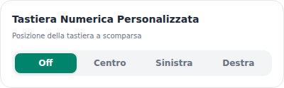
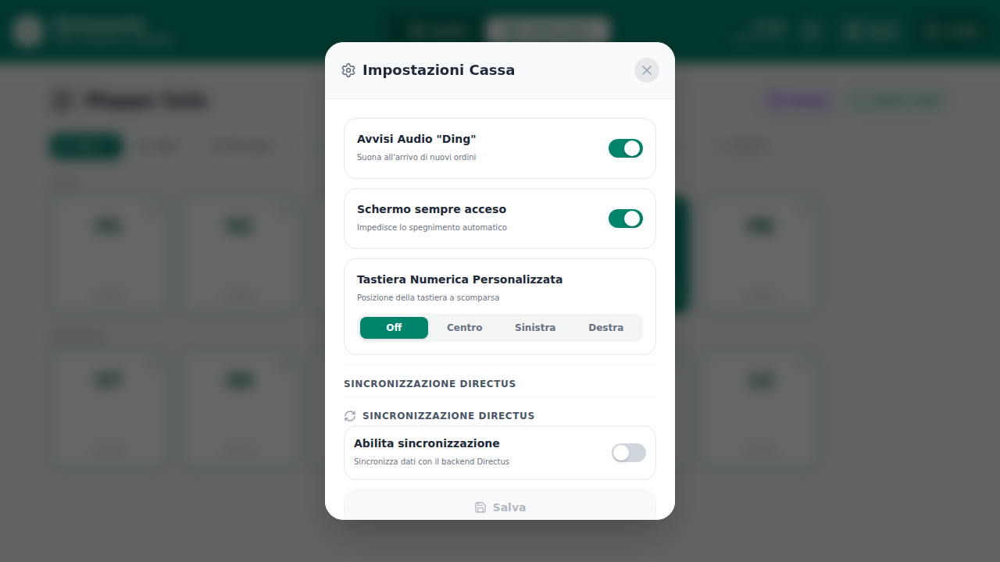

# Guida Utente — Terminale Cassa, Sala & Cucina

> Guida pratica per operatori non tecnici (cassa, camerieri, cuochi)  
> Versione documentata: Aprile 2026

---

## Indice

1. [Panoramica del sistema](#1-panoramica-del-sistema)
2. [Percorso rapido per ruolo](#2-percorso-rapido-per-ruolo)
3. [Launcher — selezione modalità](#3-launcher--selezione-modalità)
4. [App Cassa — mappa sala e tavoli](#4-app-cassa--mappa-sala-e-tavoli)
5. [App Cassa — gestione tavolo e conto](#5-app-cassa--gestione-tavolo-e-conto)
6. [App Cassa — pagamenti e chiusura](#6-app-cassa--pagamenti-e-chiusura)
7. [App Cassa — ordini](#7-app-cassa--ordini)
8. [App Cassa — dashboard e storico conti](#8-app-cassa--dashboard-e-storico-conti)
9. [App Sala — mappa e comande](#9-app-sala--mappa-e-comande)
10. [App Cucina — kanban, dettaglio, totali, cronologia](#10-app-cucina--kanban-dettaglio-totali-cronologia)
11. [Stampa comande e preconto](#11-stampa-comande-e-preconto)
12. [Impostazioni](#12-impostazioni)
13. [Autenticazione e blocco schermo](#13-autenticazione-e-blocco-schermo)
14. [Installazione PWA](#14-installazione-pwa)
15. [Offline e sincronizzazione (in parole semplici)](#15-offline-e-sincronizzazione-in-parole-semplici)
16. [Risoluzione problemi rapida](#16-risoluzione-problemi-rapida)

---

## 1. Panoramica del sistema

Il sistema ha **tre app operative** più una schermata iniziale (launcher).
Ogni reparto usa la sua app:

- **Cassa**: gestisce tavoli, conti e pagamenti
- **Sala**: prende e invia le comande
- **Cucina**: prepara i piatti e aggiorna lo stato

| App | URL locale | Uso |
|---|---|---|
| Launcher | `/` | Selezione modalità |
| Cassa | `/cassa.html` | Tavoli, incassi, report |
| Sala | `/sala.html` | Presa comande e monitoraggio tavoli |
| Cucina | `/cucina.html` | Preparazione e avanzamento comande |

### Stati ordine principali

`pending → accepted → preparing → ready → delivered → completed`  
Stato alternativo: `rejected`.

- `pending`: in attesa in Cassa
- `accepted`: accettata e inviata in cucina
- `preparing`: in lavorazione
- `ready`: pronta
- `delivered`: consegnata (conto ancora aperto)
- `completed`: conto saldato
- `rejected`: rifiutata

---

## 2. Percorso rapido per ruolo

### Operatore Cassa (flusso tipico)
1. Apri **Cassa**
2. Tocca un tavolo libero e imposta i coperti
3. Gestisci conto e voci (se serve anche “Diretto”)
4. Incassa dal pannello pagamenti
5. Chiudi il conto

### Cameriere (flusso tipico)
1. Apri **Sala**
2. Seleziona tavolo
3. Crea comanda e aggiungi piatti
4. Invia in cucina
5. Controlla avanzamento in “Comande”

### Cuoco (flusso tipico)
1. Apri **Cucina**
2. Prendi le comande in “Da Preparare”
3. Sposta in “In Cottura” e poi “Pronte”
4. Conferma “Consegnata” quando i piatti escono

---

## 3. Launcher — selezione modalità

Dalla pagina `/` puoi aprire rapidamente Cassa, Sala o Cucina in tab dedicate.

Suggerimento operativo: tieni Cassa, Sala e Cucina aperte in parallelo su dispositivi/finestre distinti.

---

## 4. App Cassa — mappa sala e tavoli

### 4.1 Vista tavoli

Stati visivi disponibili:
- **Libero**
- **In Attesa**
- **Occupato**
- **Conto richiesto**
- **Saldato**

La barra statistiche in alto è anche filtro rapido per stato tavolo.

### 4.2 Multi-sala

Con più sale configurate compaiono tab dedicate (più tab “Tutti”), con conteggio tavoli per sala.

### 4.3 Apertura tavolo

Su tavolo libero:
1. selezioni coperti (adulti e, se abilitato, bambini)
2. confermi
3. il tavolo passa in stato operativo

Se il coperto automatico è attivo, le righe coperto vengono aggiunte al conto in automatico.

### 4.4 Operazioni tavolo

Nel modale tavolo (header):
- **Conto** (flag conto richiesto)
- **Sposta** tavolo
- **Unisci** tavoli
- **Dividi** (quando consentito)
- **Storico**

---

## 5. App Cassa — gestione tavolo e conto

Nel modale tavolo trovi due aree principali:

- **Sinistra:** riepilogo voci/comande
- **Destra:** incasso e pagamento

### 5.1 Riepilogo voci

Modalità principali del pannello sinistro:
- **Per Voce** (aggregata)
- **Per Ordine**

Le modalità di incasso/checkout, come **Per Comanda** e **Analitica**, sono descritte in **§6.1**.
### 5.2 Voce Diretta (⚡)

Pulsante **Diretto**: aggiunge voci al conto senza passare per la cucina.

- Tab **Dal Menu**
- Tab **Personalizzata** (se abilitata)
- Carrello con quantità e totale

Le voci dirette sono marcate e non entrano nel flusso cucina.

### 5.3 Storni e ripristini

In vista per ordine puoi stornare righe/modificatori e ripristinarli. I netti sono calcolati automaticamente nel totale tavolo.

---

## 6. App Cassa — pagamenti e chiusura

### 6.1 Modalità pagamento

Sono disponibili 4 modalità:

1. **Tutto** (saldo unico)
2. **Alla Romana** (quote)
3. **Per Comanda** (selezione ordini)
4. **Analitica** (qty per singola voce/modificatore)

### 6.2 Funzioni in pagamento

- Metodi configurabili (es. Contanti, POS/Carta)
- Calcolo importo ricevuto
- Gestione **resto**
- Gestione **mancia**
- Sconti (% o €) se abilitati

### 6.3 Chiusura conto

A saldo completo compaiono i pulsanti:
- **Chiudi**
- **Fiscale** (richiesta scontrino fiscale)
- **Fattura** (apre modale dati fattura)

Per conti a importo zero i pulsanti Fiscale/Fattura non sono disponibili.

### 6.4 Dati fattura

Il modale fattura richiede i dati anagrafici/fiscali con validazioni sui campi (CF/P.IVA, CAP, SDI/PEC, ecc.).

---

## 7. App Cassa — ordini

Tab operative:
- **In Attesa**
- **In Cucina**
- **Chiusi**

### 7.1 In Attesa

Su ordine pending puoi:
- **Inviare/Accettare**
- **Eliminare/Rifiutare**

Il rifiuto è protetto da modale con **causale** (preset + “Altro” con testo).

### 7.2 In Cucina

Visualizza gli ordini accepted/preparing/ready e l’area consegnate.

È disponibile override **Consegnata** in Cassa per casi operativi urgenti.

### 7.3 Dettaglio ordine

Dal pannello dettaglio puoi:
- aprire tavolo in cassa
- gestire nota globale ordine
- modificare note/portate/modificatori delle singole righe

---

## 8. App Cassa — dashboard e storico conti

### 8.1 Dashboard

Include:
- **Fondo cassa** iniziale
- **Movimenti** (versamenti/prelievi)
- **Lettura X** (senza azzeramento)
- **Lettura Z** (chiusura con archiviazione)

Nel riepilogo sono inclusi anche indicatori fiscali/fattura.

### 8.2 Storico conti

Mostra i conti chiusi con:
- dettaglio transazioni
- aggregati (incasso totale, media, numero conti)
- mancia postuma
- emissione fiscale/fattura postuma (se non già emessa)

---

## 9. App Sala — mappa e comande

### 9.1 Mappa sala

Stati tavolo lato sala:
- Libero
- In Attesa
- Occupato
- (visibilità operativa su saldato nei flussi correlati)

Supporta multi-sala e operazioni tavolo principali (sposta/unisci secondo regole stato).

### 9.2 Lista comande

Tab:
- In Attesa
- In Cucina
- Chiusi

### 9.3 Creazione comanda

Flusso:
1. Nuova comanda
2. selezione piatti da menu
3. eventuale dettaglio piatto (info, allergeni, ingredienti)
4. modifiche voce (portata/note/modificatori)
5. invio comanda

### 9.4 Dettaglio comanda

Nella gestione ordini sala è presente anche il rifiuto con modale e causale (allineato al flusso Cassa).

### 9.5 Consegnata da Sala

Per stati `accepted/preparing/ready` puoi marcare l’ordine come consegnato (`delivered`).

---

## 10. App Cucina — kanban, dettaglio, totali, cronologia

La Cucina ha 4 tab:
1. **Kanban**
2. **Dettaglio**
3. **Totali**
4. **Cronologia**

### 10.1 Kanban

Tre colonne:
- Da Preparare (`accepted`)
- In Cottura (`preparing`)
- Pronte (`ready`)

Transizioni inverse supportate:
- preparing → accepted
- ready → preparing
- accepted → pending (rimanda in sala con conferma)

### 10.2 Consegna protetta (annulla)

Il pulsante **Consegnata** usa countdown di sicurezza (5s):
- primo click: avvia conto alla rovescia “Annulla (Xs)”
- secondo click entro il tempo: annulla
- a fine timer: stato `delivered`

### 10.3 Tab Dettaglio

Lista ordini attivi con:
- righe per portata
- toggle per segnare singoli item come pronti
- pulsante consegnata con stessa logica countdown

### 10.4 Tab Totali

Vista aggregata piatti per quantità totale su ordini attivi, con filtro stato:
- Tutti
- Da Preparare
- In Cottura
- Pronte

### 10.5 Tab Cronologia

Ordini `delivered` in sola consultazione, con azione di ripristino a `ready` se necessario.

---

## 11. Stampa comande e preconto

### 11.1 Cronologia stampe

Da Cassa (Mappa Sala) pulsante **Stampe**:
- elenco job (`order`, `table_move`, `pre_bill`)
- stato job (`pending`, `printing`, `done`, `error`)
- ristampa su stessa o altra stampante configurata

### 11.2 Tipi di stampa

- **Comanda** all’accettazione ordine
- **Sposta tavolo**
- **Preconto**

### 11.3 Stampante preconto

Nelle impostazioni Cassa è selezionabile la stampante predefinita per `pre_bill` (o nessuna).

---

## 12. Impostazioni

### 12.1 Generali

- Avvisi audio
- Schermo sempre acceso (Wake Lock, se supportato)
- Sorgente menu (Directus / URL JSON)
- URL manuale sincronizzazione menu (se `menuSource` è `JSON`)

### 12.2 Tastiera numerica personalizzata (Cassa)

Modalità:
- Disattivata
- Centro
- Sinistra
- Destra

### 12.3 Sincronizzazione Directus (amministratore)

Sezione dedicata con:
- attiva/disattiva sincronizzazione
- URL, token, ID venue
- abilita/disabilita WebSocket
- test di connessione
- salvataggio configurazione
- invio/ricezione manuale dati
- registro coda sincronizzazione
- procedura guidata di riapplicazione completa configurazione (con opzione svuota cache locale)

### 12.4 Gestione utenti

Quando non esiste alcun amministratore compare il pulsante dedicato **Aggiungi amministratore**.

Con admin presente compare **Gestione Utenti & Blocco Schermo**.

### 12.5 Reset dati

Reset completo disponibile solo admin, con conferma esplicita.

---

## 13. Autenticazione e blocco schermo

Sistema opzionale a PIN.

- Se non ci sono utenti: accesso libero
- Primo utente creato manualmente: amministratore
- Accesso limitabile per app (`cassa`, `sala`, `cucina`)
- Blocco automatico configurabile
- PIN gestiti in forma hash

La lock screen mostra solo utenti autorizzati per l’app corrente.

---

## 14. Installazione PWA

Supporto installazione mobile/desktop:
- banner installazione Android
- istruzioni iOS (Aggiungi a Home)
- comportamento standalone quando installata

Manifest dedicati per app operative.

---

## 15. Offline e sincronizzazione (in parole semplici)

### 15.1 Dove vengono salvati i dati

I dati di lavoro vengono salvati localmente nel browser (anche se chiudi la pagina).
- ordini
- tavoli/sessioni conto
- transazioni
- movimenti cassa
- chiusure
- log/code di sincronizzazione

### 15.2 Aggiornamento tra schermate aperte

Se apri più schermate sullo stesso dispositivo/browser, i dati si aggiornano tra loro.

### 15.3 Sincronizzazione con server (se attiva)

- coda operazioni offline
- push/pull asincrono
- supporto WebSocket con fallback
- log diagnostico da UI

---

## 16. Risoluzione problemi rapida

- **Menu non aggiornato:** controlla sorgente menu nelle impostazioni e rilancia sync manuale.
- **Stampa non parte:** verifica stampanti configurate e stato job in “Stampe”.
- **Utente non visibile in lock screen:** controlla permessi app assegnati all’utente.
- **Dati non allineati tra dispositivi distinti:** attiva/configura sincronizzazione Directus.
- **Wake lock non disponibile:** browser/dispositivo non supportato.

---

*Documento aggiornato il 21 Aprile 2026, con revisione orientata a operatori finali non tecnici (cassa/sala/cucina).*
