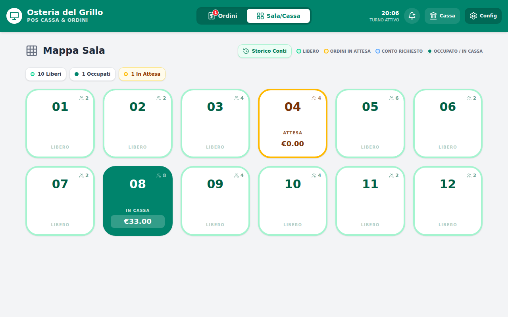
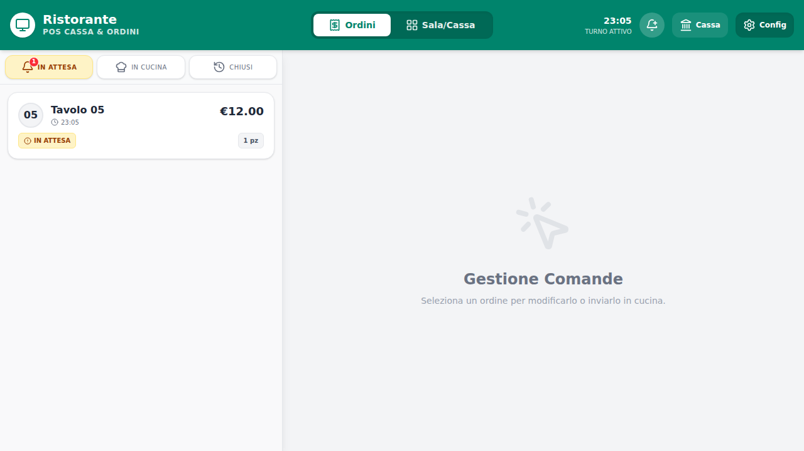
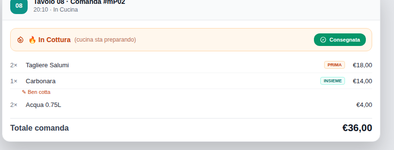
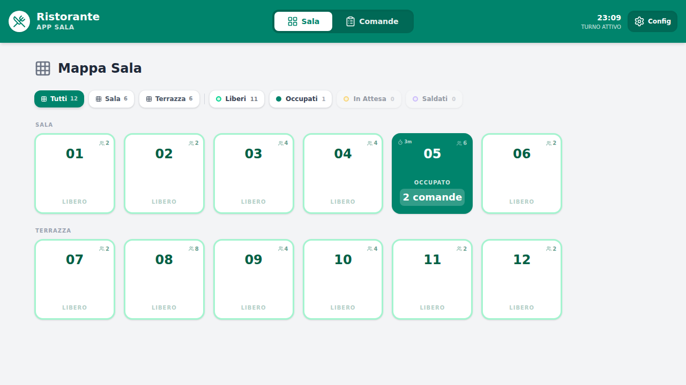
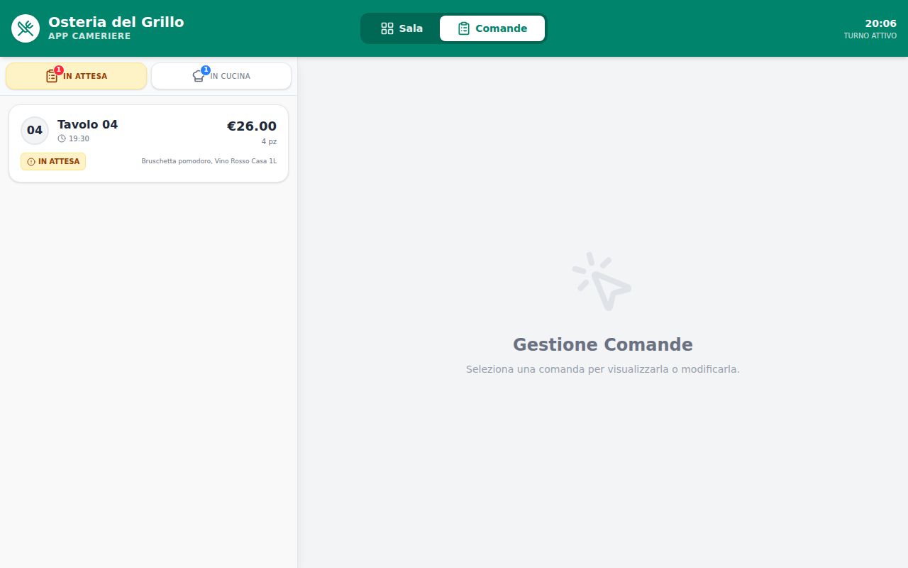
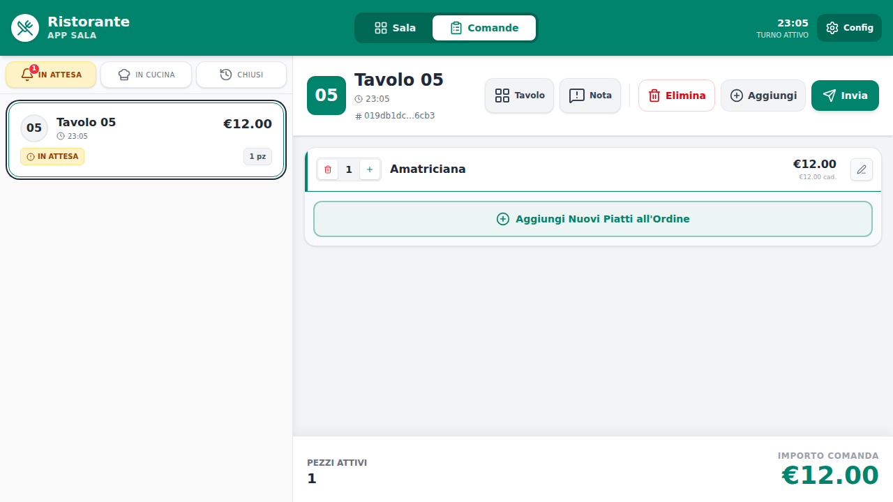
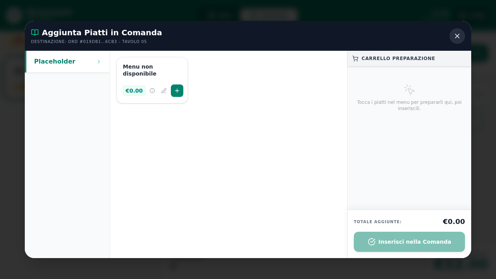
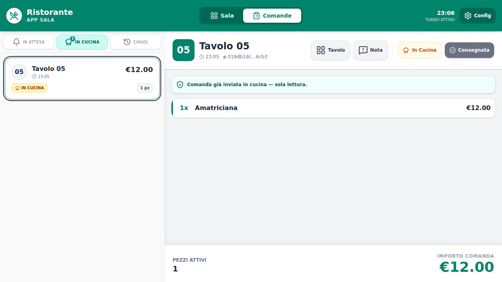
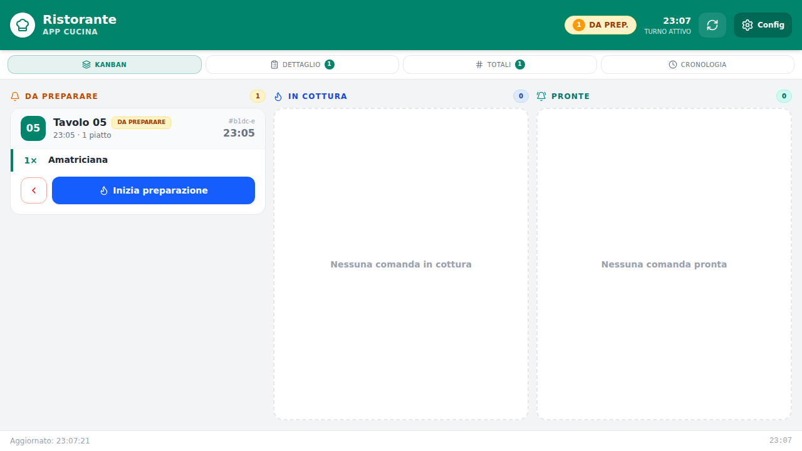
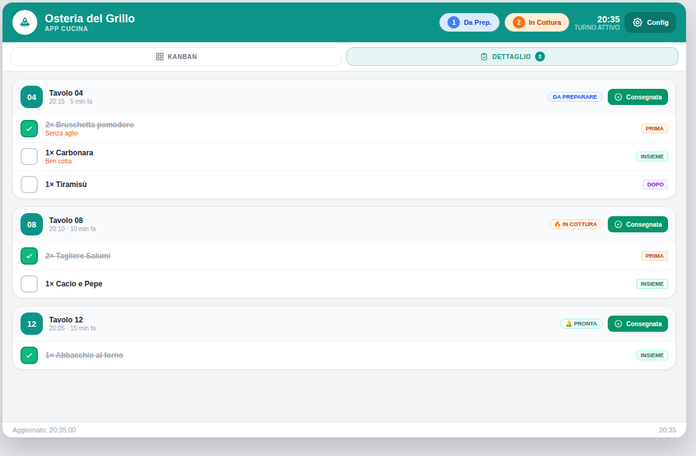

# Guida Utente — Terminale Cassa, Sala & Cucina

> Sistema POS per ristoranti — *Osteria del Grillo*  
> Versione documentata: Marzo 2026

---

## Indice

1. [Panoramica del Sistema](#1-panoramica-del-sistema)
2. [Launcher — Selezione Modalità](#2-launcher--selezione-modalità)
3. [App Cassa — Mappa Sala e Gestione Tavoli](#3-app-cassa--mappa-sala-e-gestione-tavoli)
4. [App Cassa — Cassa e Pagamenti](#4-app-cassa--cassa-e-pagamenti)
5. [App Cassa — Gestione Ordini](#5-app-cassa--gestione-ordini)
6. [App Cassa — Dashboard Finanziaria](#6-app-cassa--dashboard-finanziaria)
7. [App Cassa — Storico Conti](#7-app-cassa--storico-conti)
8. [App Sala — Mappa Sala](#8-app-sala--mappa-sala)
9. [App Sala — Gestione Comande](#9-app-sala--gestione-comande)
10. [App Cucina — Display Cucina](#10-app-cucina--display-cucina)
11. [Impostazioni e Configurazione](#11-impostazioni-e-configurazione)
12. [Autenticazione e Blocco Schermo](#12-autenticazione-e-blocco-schermo)
13. [Installazione PWA](#13-installazione-pwa)
14. [Analisi Critica e Suggerimenti Evolutivi (Audit UX)](#14-analisi-critica-e-suggerimenti-evolutivi-audit-ux)

---

## 1. Panoramica del Sistema

Il sistema è composto da **tre applicazioni web** indipendenti che condividono lo stesso database locale (Pinia + `localStorage`). Ogni applicazione è progettata per un ruolo specifico:

| App | Url locale | Pubblico |
|-----|-----------|---------|
| **Launcher** | `/` | Schermata di selezione modalità |
| **Cassa** | `/cassa.html` | Cassiere / Manager |
| **Sala** | `/sala.html` | Personale di sala / Camerieri |
| **Cucina** | `/cucina.html` | Display cucina |

### Flusso operativo tipico

```
Sala (cameriere)           Cassa (cassiere)           Cucina (cuoco)
      │                          │                          │
      ├─ Apre tavolo              │                          │
      ├─ Prende ordinazione       │                          │
      ├─ Invia comanda ──────────►│                          │
      │                          ├─ Riceve notifica ding     │
      │                          ├─ Accetta ordine ─────────►│
      │                          │                          ├─ Prepara piatti
      │                          │                          ├─ Segna "Pronta"
      │◄─ Notifica pronta ────────│◄─ Aggiorna stato ────────│
      │                          │                          │
      ├─ Consegna piatti          │                          │
      ├─ Segna "Consegnata" ─────►│                          │
      │                          │                          │
      │                          ├─ Cliente chiede conto     │
      │                          ├─ Seleziona pagamento      │
      │                          └─ Chiude conto/tavolo      │
```

### Sincronizzazione in tempo reale

Le tre app si sincronizzano automaticamente tra tab del browser tramite l'evento `localStorage`. Ogni modifica (es. cambio stato ordine effettuato in Cucina) appare istantaneamente in Cassa e Sala, senza ricaricare la pagina.

---

## 2. Launcher — Selezione Modalità

L'URL principale (`/`) mostra una schermata di selezione con tre pulsanti grandi:

- **Cassa** — apre l'applicazione cassa in una nuova tab
- **Sala** — apre l'applicazione sala in una nuova tab
- **Cucina** — apre l'applicazione cucina in una nuova tab

> **Consiglio operativo:** In un ristorante tipico si tengono aperte in tab separate: Cassa sul tablet del cassiere, Sala sui dispositivi dei camerieri, Cucina sul display in cucina.

---

## 3. App Cassa — Mappa Sala e Gestione Tavoli



### 3.1 Navigazione principale

La navbar della Cassa contiene:

| Elemento | Descrizione |
|---------|-------------|
| **Tab "Sala/Cassa"** | Mappa sala con gestione tavoli e pagamenti |
| **Tab "Ordini"** | Gestione e approvazione comande con badge rosso contatore |
| **Orologio** | Ora corrente aggiornata al secondo (nascosto su mobile) |
| **Pulsante Dashboard** (🏛️) | Apre il cruscotto finanziario |
| **Pulsante Blocco** (🔒) | Blocca schermo (visibile solo se autenticazione attiva) |
| **Pulsante Impostazioni** (⚙️) | Apre le impostazioni dell'app |

### 3.2 Mappa sala

La mappa mostra tutti i tavoli configurati con stati visivi distinti:

| Stato | Colore bordo | Testo visualizzato | Significato |
|-------|-------------|-------------------|-------------|
| **Libero** | Verde smeraldo chiaro | — | Nessun cliente |
| **In Attesa** | Ambra | "Attesa" | Comande inviate, non ancora accettate |
| **Conto Richiesto** | Blu | "Conto!" | Cliente ha richiesto il conto |
| **Occupato** | Verde tema (teal) | "In Cassa" + importo residuo | Ordini accettati/in preparazione |

#### Più sale (raggruppamento)

Quando sono configurate **più sale** (es. Sala Interna + Terrazza), sopra la griglia dei tavoli appaiono le **tab di selezione sala**:

- Ogni tab mostra il nome della sala e il numero di tavoli che contiene
- Fare clic su una tab filtra la griglia mostrando solo i tavoli di quella sala
- La **barra statistiche** (Liberi / Occupati / In Attesa) rimane sempre globale e conta i tavoli di tutte le sale
- La configurazione avviene in `appConfig.rooms` tramite `src/utils/index.js`

La **barra statistiche** in cima alla mappa mostra le pillole di riepilogo:
- 🟢 **Liberi** — tavoli disponibili
- 🔵 **Occupati** — tavoli con clienti e ordini attivi  
- 🟡 **In Attesa** — tavoli con comande non ancora approvate

### 3.3 Aprire un tavolo

1. Toccare un tavolo **Libero** sulla mappa
2. Si apre la finestra di selezione coperti:
   - Inserire il numero di **adulti** (obbligatorio, +/−)
   - Inserire il numero di **bambini** (visibile solo se il coperto bambini è configurato)
3. Premere **Conferma** → il tavolo si apre e il coperto viene aggiunto automaticamente (se `autoAdd: true`)

> **Coperto automatico:** al primo accesso al tavolo, le voci "Coperto" (adulti) e "Coperto bambino" vengono aggiunte direttamente al conto senza passare per la cucina, in base al numero di coperti inserito.

### 3.4 Riepilogo Voci (pannello sinistro)

Una volta aperto il tavolo, il pannello sinistro mostra le voci del conto. Esistono due modalità di visualizzazione selezionabili in alto:

#### Vista "Per Voce" (aggregata)

Raggruppa le stesse voci sommando le quantità. Ogni riga mostra:
- Badge quantità (es. `3×`)
- Nome del piatto
- Importo subtotale
- Eventuale badge "storn." in rosso per voci stornate
- Badge ⚡ "Diretta" per voci aggiunte senza cucina

Sotto ogni voce principale compaiono le **varianti a pagamento** in rientro (sfondo viola), con badge quantità e prezzo.

#### Vista "Per Ordine"

Mostra ogni comanda separata come card con:
- ID comanda abbreviato
- Badge stato colorato (Voce Diretta / In Attesa / In Cucina)
- Importo della comanda
- Voci singole con quantità e prezzo
- Pulsanti storno (🚫 arancione) e ripristino (↩ blu) per ogni riga

**Storno di una voce:**
1. Passare alla vista "Per Ordine"
2. Premere 🚫 sulla voce da stornare
3. Scegliere quantità da stornare
4. La riga appare barrata con importo ridotto

### 3.5 Operazioni avanzate sul tavolo

I pulsanti nell'header del pannello tavolo permettono:

| Pulsante | Azione |
|---------|--------|
| 🧾 **Conto Richiesto** | Attiva/disattiva il flag "cliente ha chiesto il conto" (il tavolo diventa blu sulla mappa) |
| ↗ **Sposta** | Trasferisce tutti gli ordini e le transazioni a un altro tavolo libero |
| 🔗 **Unisci** | Combina due tavoli occupati: gli ordini del tavolo sorgente si spostano nel tavolo destinazione, i coperti si sommano |
| 📄 **Storico Conti** | Visualizza tutti i conti chiusi per questo tavolo nella sessione |

#### Spostare un tavolo

1. Premere **Sposta**
2. Si apre una griglia con i tavoli liberi disponibili
3. Selezionare il tavolo destinazione → tutti gli ordini vengono trasferiti

#### Unire due tavoli

1. Premere **Unisci**
2. Si apre la griglia dei tavoli occupati
3. Selezionare il tavolo con cui unire → il tavolo corrente si libera, gli ordini confluiscono nel destinazione

### 3.6 Voce Diretta (⚡)

La voce diretta permette di aggiungere voci al conto **senza passare per la cucina**, ideale per: caffè al banco, coperto aggiuntivo, bibite, servizi accessori o voci dimenticate.

**Come usarla:**
1. Aprire un tavolo occupato
2. Premere il pulsante ⚡ **Voce Diretta** nel pannello sinistro
3. Si apre il modale con due tab:

**Tab "Dal Menu"**
- Barra laterale sinistra: categorie del menu (scorribili)
- Griglia centrale: piatti della categoria selezionata
- Toccare un piatto lo aggiunge al carrello (tocchi multipli aumentano la quantità)

**Tab "Personalizzata"** *(solo admin, se abilitata nella configurazione)*
- Form: nome voce libero + prezzo
- Pulsante **Aggiungi** per creare la voce
- Le voci create vengono salvate automaticamente per riutilizzo rapido
- Voci bloccate 🔒 (coperto adulto/bambino): predefinite dalla configurazione, non eliminabili
- Voci salvate: eliminabili singolarmente con ✕

**Carrello:**
- Lista voci selezionate con controlli +/−
- Totale aggiornato in tempo reale
- Pulsante **Aggiungi al Conto** per confermare

Le voci aggiunte tramite Voce Diretta appaiono immediatamente nel conto con il badge ⚡ "Diretta" e non richiedono approvazione cucina.

---

## 4. App Cassa — Cassa e Pagamenti

Il pannello destro del modale tavolo è dedicato al pagamento.

### 4.1 Riepilogo conto

In cima al pannello viene mostrato:
- **Totale conto**: somma di tutti gli ordini accettati + voci dirette
- **Rimanente Netto**: importo ancora da incassare (dopo eventuali pagamenti parziali)
- **Storico transazioni**: pagamenti già eseguiti nella sessione, con metodo, importo, mancia, ora e ID

### 4.2 Sconti *(solo admin)*

Visibile quando gli sconti sono abilitati e c'è un saldo residuo:
- Selezionare il tipo: **%** (percentuale) o **€** (importo fisso)
- Inserire il valore
- Premere **Applica** → lo sconto viene detratto dall'importo rimanente con anteprima in tempo reale

### 4.3 Modalità di pagamento

Quattro modalità selezionabili con i tab in cima al pannello di incasso:

#### Tutto (pagamento unico)

Incassa l'intero saldo residuo in un'unica transazione. È la modalità più semplice.

#### Alla Romana (divisione equa)



Permette di dividere il conto in quote uguali tra più persone:

1. **Imposta il numero di quote** con i pulsanti +/− ("Dividi Conto In")
2. **Quote già pagate** vengono mostrate (es. "2/4 quote già pagate")
3. Se rimangono più di 1 quota non pagata, è possibile scegliere **quante quote incassare ora**
4. L'importo per quota viene calcolato automaticamente
5. Selezionare il metodo di pagamento → la transazione viene registrata

**Esempio pratico:**  
Conto da €100, 4 persone. Quota = €25. 
- Persona 1 paga: 1 quota = €25 → rimangono 3/4  
- Persone 2+3 insieme: 2 quote = €50 → rimane 1/4  
- Persona 4 paga: ultima quota = €25 → conto saldato e tavolo liberato

#### Per Comanda (selezione manuale)

Permette di selezionare individualmente quali comande pagare in questa transazione:
- Ogni comanda accettata appare come checkbox con l'importo
- Spuntare le comande da saldare
- Il totale si aggiorna dinamicamente
- Utile per pagamenti separati su gruppi che hanno ordinato comande distinte

#### Analitica (selezione voce per voce)

Permette di scegliere esattamente **quante unità** di ogni singola voce incassare in questa transazione:

- Ogni voce (e ogni variazione a pagamento) appare come riga con uno stepper **[−] qty [+]**
- Lo stepper parte da 0 e arriva alla quantità netta pagabile (es. 2 coperti → max 2)
- Voci dirette (⚡) sono evidenziate con l'icona corrispondente
- Le variazioni a pagamento appaiono come sotto-righe indentate in viola
- L'acconto si aggiorna in tempo reale: `qty × prezzo unitario`
- **Seleziona Tutto** / **Deseleziona Tutto** per comodità
- Se il totale selezionato supera il saldo rimanente, viene mostrato un avviso e i pulsanti di pagamento vengono disabilitati
- Una comanda viene chiusa automaticamente solo quando tutte le sue voci (incluse variazioni a pagamento) sono state integralmente selezionate e pagate

**Esempio pratico:**  
Tavolo con 2 coperti (€2.50 cad.) e 1 Tagliere x2 (€20.00).
- Selezionare 1 coperto (qty=1) → Acconto €2.50
- Selezionare il Tagliere (qty=1) + 1 coperto → Acconto €22.50
- Incassare → rimane da pagare €2.50 (il secondo coperto)

### 4.4 Mancia

Se le mance sono abilitate, appare un campo opzionale per inserire la mancia. Il totale da incassare si aggiorna mostrando "Totale da incassare (con mancia): €X.XX".

### 4.5 Calcolatore resto

Visibile quando il metodo di pagamento selezionato è **Contanti**:
- Inserire l'importo ricevuto dal cliente
- Il sistema calcola e mostra in verde il **resto da dare**
- Se l'importo è insufficiente appare in rosso "Importo insufficiente (mancano €X.XX)"

### 4.6 Pulsanti metodo di pagamento

I pulsanti per ogni metodo configurato (default: **Contanti** e **Pos/Carta**) permettono di confermare il pagamento. Una volta premuto:
1. La transazione viene registrata
2. L'importo rimanente si riduce
3. Il pulsante **Chiudi Conto** appare non appena il conto è saldato interamente: premendo il pulsante il tavolo viene liberato e viene generato il riepilogo finale

---

## 5. App Cassa — Gestione Ordini


La tab **Ordini** in navbar mostra tutte le comande ricevute, suddivise in tre sotto-tab:

### 5.1 Tab "In Attesa"

Comande inviate dalla Sala e in attesa di essere accettate. Ogni card mostra:
- Puntino ambra + contatore voci + orario di invio
- Badge "In Attesa"
- Sfondo ambra per segnalare urgenza

**Azioni disponibili sul dettaglio ordine:**
- **Elimina** (rosso) — rifiuta la comanda (stato → `rejected`)
- **Invia** (verde/teal) — accetta e invia in cucina (stato → `accepted`)

> ⚠️ **Attenzione:** Il rifiuto avviene senza dialogo di conferma — toccare "Elimina" elimina immediatamente la comanda (vedi sezione 14 per il suggerimento migliorativo).

### 5.2 Tab "In Cucina"

Comande accettate, in preparazione o pronte. Suddivise in due sezioni:
- **In lavorazione** — ordini con stato `accepted`, `preparing`, `ready`
- **Consegnate** (divisore grigio) — ordini con stato `delivered`

**Azioni disponibili:**
- Pulsante **Consegnata** — forza lo stato a `delivered` senza aspettare la cucina (utile per ordini veloci o bypass)

> **Override "Consegnata":** disponibile per gli stati `accepted`, `preparing`, `ready`. Utile quando il cameriere consegna direttamente senza aggiornamento dalla cucina.



### 5.3 Tab "Chiusi"

Comande saldate (`completed`) o rifiutate (`rejected`), visibili a solo scopo storico.

### 5.4 Dettaglio ordine

Cliccando su una comanda nella lista laterale si apre il pannello di dettaglio:

- **Header**: numero tavolo, ID comanda, eventuale badge allergie
- **Pulsante Cassa** (🖩) — salta alla schermata cassa del tavolo
- **Pulsante Nota** (💬) — aggiunge/modifica una nota globale sull'ordine (visibile in cucina)
- **Lista voci** con nome, quantità, prezzo unitario, note cucina, modificatori
- **Totale comanda** in fondo

### 5.5 Modale nota/variante piatto

Aprendo la modifica di una singola voce si può:

- **Impostare la portata** (ordine di uscita):
  - 🟠 **Esce Prima** — antipasti, prima uscita
  - 🟢 **Insieme** — piatto principale, uscita standard
  - 🟣 **Esce Dopo** — dessert, ultima uscita
- **Aggiungere varianti a pagamento** — nome + prezzo (es. "Mozzarella +€1.50")
- **Aggiungere note cucina** — testo libero con preset rapidi ("Senza sale", "Ben cotto", "No formaggio", "Da dividere")

---

## 6. App Cassa — Dashboard Finanziaria

Il cruscotto finanziario è accessibile dal pulsante 🏛️ nella navbar. Gestisce il fondo cassa, i movimenti e le chiusure giornaliere.

### 6.1 Tab "Fondo Cassa"

**Fondo cassa iniziale:**
- Inserire l'importo del fondo iniziale del turno
- Preset rapidi: **€50**, **€100**, **€150**, **€200**
- Premere **Salva** per confermare
- Viene mostrato il saldo attuale in verde

**Versamenti e Prelievi:**
- Selezionare il tipo: **Versamento** (entrata) o **Prelievo** (uscita)
- Inserire importo e causale (es. "Cambio moneta", "Prelievo fine turno")
- Lista dei movimenti in ordine cronologico inverso con orario e importo

### 6.2 Tab "Lettura X" (Report senza azzeramento)

Visualizza il riepilogo della giornata senza chiudere il turno:

| Campo | Descrizione |
|-------|-------------|
| **Totale Incassato** | Somma di tutti i pagamenti del turno |
| **Per Metodo** | Breakdown per tipo di pagamento (contanti / carta) |
| **Coperti** | Numero totale di coperti serviti |
| **Scontrini** | Numero di conti chiusi |
| **Scontrino Medio** | Importo medio per conto |
| **Sconti** | Totale sconti applicati |
| **Mance** | Totale mance incassate |
| **Cassa Fisica** | Fondo iniziale + movimenti netti = fondo finale stimato |

Premere **Aggiorna Lettura X** per aggiornare i dati.

### 6.3 Tab "Lettura Z" (Chiusura giornata)

> ⚠️ **Operazione irreversibile.** La chiusura Z azzera tutte le transazioni e i movimenti del turno.

**Procedura di chiusura:**
1. Verificare il **Riepilogo da Chiudere** (totale, per metodo, sconti, mance, conti, coperti)
2. (Opzionale) Premere **Anteprima Chiusura** per un riepilogo prima di procedere
3. Premere **Esegui Lettura Z** *(solo admin)*
4. Confermare il dialogo: "Confermi la Chiusura Z? Totale: €XXX.XX. Questa operazione è irreversibile."
5. I dati vengono azzerati e la chiusura viene archiviata in **Chiusure Precedenti**

**Chiusure precedenti:** visibili nella stessa tab, in ordine cronologico inverso, con totale, data/ora e dettaglio per metodo di pagamento.

---

## 7. App Cassa — Storico Conti

Accessibile dal pulsante **Storico Conti** nella mappa sala o nell'header del pannello tavolo.

Mostra tutti i conti chiusi della sessione con:
- **Card per sessione conto**: tavolo, coperti, orario chiusura, totale, mance, sconti applicati
- **Dettaglio espandibile** per ogni transazione: metodo, importo, orario
- **Statistiche aggregate** in fondo: conti totali, incasso totale, scontrino medio

---

## 8. App Sala — Mappa Sala



### 8.1 Navigazione

La navbar Sala contiene:
- **Tab "Sala"** — mappa sala con tavoli
- **Tab "Comande"** — lista comande con badge notifica
- **Orologio**, **Blocco**, **Impostazioni** (stessa struttura della Cassa)

### 8.2 Mappa sala semplificata

Stessa griglia della Cassa ma con interfaccia più semplice:

| Stato | Visualizzato |
|-------|-------------|
| **Libero** | Tavolo vuoto, cliccabile |
| **In Attesa** | Tavolo con comande aperte in attesa, con numero comande |
| **Occupato** | Tavolo con conto aperto, con numero comande |

Nella sezione **Comande** e nei relativi filtri è presente anche lo stato **`Saldato`**.
Quando sono configurate **più sale**, l'App Sala mostra le stesse **tab di selezione sala** dell'App Cassa — vedere [§ 3.2 Più sale](#più-sale-raggruppamento).

### 8.3 Aprire un tavolo libero

1. Toccare il tavolo **Libero**
2. Modale **selezione coperti**: inserire adulti (+/− bambini se abilitato)
3. Premere **Conferma** → si apre automaticamente il modale di creazione comanda

### 8.4 Tavolo occupato — azioni

Toccando un tavolo già occupato si apre il pannello con:
- Numero tavolo + coperti + durata occupazione
- Pulsante **Nuova Comanda** per aggiungere un'altra comanda al tavolo
- Lista delle comande attive con stato e anteprima voci
- Pulsanti **Sposta** e **Unisci** (stessa funzionalità della Cassa)

---

## 9. App Sala — Gestione Comande



### 9.1 Lista comande (sidebar)



Tre tab identiche alla Cassa:
- **In Attesa** — comande non ancora inviate in cucina
- **In Cucina** — comande in lavorazione o pronte
- **Chiusi** — comande completate

### 9.2 Creazione di una nuova comanda



1. Aprire un tavolo → premere **Nuova Comanda**
2. Si apre il pannello menu con:
   - **Barra categorie** (scorribile in orizzontale su mobile)
   - **Griglia piatti** (2-3 colonne)
3. Toccare un piatto per aggiungerlo rapidamente
4. Per aggiungere con dettagli: toccare il pulsante ℹ️ → si apre **DishInfoModal** con:
   - Foto del piatto (se disponibile)
   - Descrizione e ingredienti
   - Allergeni (in badge colorati)
   - Pulsante **Aggiungi Subito** (quantità 1)
   - Pulsante **Aggiungi con Dettagli** → form con quantità, note, portata e modificatori
5. Una volta inseriti tutti i piatti premere **Invia Comanda**

### 9.3 Modificare una voce prima dell'invio

Prima dell'invio in cucina, ogni voce è modificabile:
- Toccare il pulsante modifica (✏️) → modale con:
  - **Portata**: Esce Prima / Insieme / Esce Dopo
  - **Varianti a pagamento**: nome + prezzo
  - **Note cucina**: testo libero + preset ("Senza sale", "Ben cotto", "No formaggio", "Da dividere")

### 9.4 Segnare una comanda come consegnata



Per gli ordini in stato `accepted`, `preparing` o `ready`:
- Premere **Consegnata** → lo stato passa a `delivered`
- Il conto rimane aperto (la comanda non è pagata)
- Visibile nella sezione "Consegnate" della tab "In Cucina"

---

## 10. App Cucina — Display Cucina



L'app cucina è progettata per il display in cucina, con schermo sempre acceso (Wake Lock API).

### 10.1 Header

Mostra i contatori colorati degli ordini attivi:
- 🟡 **Da Prep.** — ordini accettati, in attesa di preparazione
- 🔵 **In Cottura** — ordini in preparazione
- 🟢 **Pronte** — ordini pronti per la consegna

### 10.2 Flusso stati in cucina

```
accepted ──► preparing ──► ready ──► delivered
(Da Preparare)  (In Cottura)  (Pronte)  (Consegnate)

← transizioni inverse supportate →
ready ──► preparing (torna in cottura)
preparing ──► accepted (torna a Da Preparare)
accepted ──► pending (rimanda in sala)
```

### 10.3 Tab Kanban (default)

Tre colonne side-by-side (su mobile: sovrapposte):

**Colonna 1 — DA PREPARARE** (ordini `accepted`)
- Card con: tavolo, ora, voci per portata
- Pulsante: **"Inizia preparazione"** 🔥 → stato `preparing`
- Pulsante ← (torna a `pending` / rimanda in sala)

**Colonna 2 — IN COTTURA** (ordini `preparing`)
- Pulsante: **"Segna Pronta"** 🔔 → stato `ready`
- Pulsante ← → torna a `accepted`

**Colonna 3 — PRONTE** (ordini `ready`)
- Pulsante: **"Consegnata"** ✓ → stato `delivered`
- Pulsante ← → torna a `preparing`

### 10.4 Tab Dettaglio



Lista piatta di tutti gli ordini attivi (`accepted`, `preparing`, `ready`):
- Colore bordo/header card rispecchia lo stato kanban
- Voci raggruppate per portata con intestazioni colorate
- **Toggle ✓** per marcare singoli piatti come pronti (sincronizzato con il kanban)
- Pulsante **Consegnata** per forzare lo stato a `delivered`

### 10.5 Tab Cronologia

Lista in sola lettura degli ordini `delivered`, ordinati dal più recente. Consultabile per riferimento durante il servizio.

### 10.6 Card comanda — Struttura

Ogni card mostra:

| Sezione | Contenuto |
|---------|-----------|
| **Header** | Badge tavolo circolare, stato, ora invio, ID ordine, tempo trascorso (🟢<5min / 🟡5-10min / 🔴>10min) |
| **Voci per portata** | Quantità + nome piatto, colorati per portata; barratura se pronto |
| **Note cucina** | Testo ambra con ✏️ per ogni voce con nota |
| **Varianti** | Badge viola per ogni modificatore (+nome +prezzo) |
| **Allergie/Diete** | Badge rossi in fondo (visibili solo se presenti) |
| **Nota globale** | Sezione ambra con nota dell'ordine (se visibile in cucina) |

**Colori portata:**
- 🟠 **Esce Prima** — bordo e quantità arancione
- ⬜ **Insieme** — bordo e quantità grigio/tema
- 🟣 **Esce Dopo** — bordo e quantità viola

---

## 11. Impostazioni e Configurazione

Accessibili dal pulsante ⚙️ in ogni app. Le impostazioni sono specifiche per ogni app (Cassa, Sala, Cucina).

### 11.1 Avvisi audio ("Ding")

Toggle per abilitare/disabilitare il suono di notifica alla ricezione di nuovi ordini. Generato con la Web Audio API (nessuna dipendenza esterna).

### 11.2 Schermo sempre acceso

Toggle per la **Screen Wake Lock API**: previene il blocco automatico del display mentre l'app è in uso. Si riacquisisce automaticamente al rientro dallo screensaver. Visibile solo se il browser supporta la funzionalità.

### 11.3 Tastiera numerica personalizzata *(solo Cassa)*

Configura la posizione dell'overlay tastiera numerica virtuale (sostituisce la tastiera del dispositivo per i campi numerici):

| Valore | Comportamento |
|--------|--------------|
| **Off** | Usa la tastiera nativa del dispositivo |
| **Centro** | Overlay al centro dello schermo |
| **Sinistra** | Overlay ancorato a sinistra |
| **Destra** | Overlay ancorato a destra |

### 11.4 URL Menu JSON

Campo per modificare l'URL del menu remoto. Premere **Sincronizza Menu** per ricaricare il menu dal nuovo URL. In caso di errore viene mostrato il messaggio di errore specifico.

### 11.5 Gestione Utenti & Blocco Schermo

Pulsante che apre il pannello di gestione utenti (vedi sezione 12).

### 11.6 Ripristina dati di default *(solo admin)*

Pulsante rosso per azzerare completamente tutti i dati:
- Ordini, transazioni, tavoli, movimenti di cassa, chiusure
- Utenti e impostazioni di autenticazione
- Voci personalizzate (Voce Diretta)

Richiede doppia conferma: "Sì, ripristina".

---

## 12. Autenticazione e Blocco Schermo

Il sistema di autenticazione è **opzionale**. Senza utenti configurati, l'accesso è libero.

### 12.1 Creazione del primo utente (Amministratore)

1. Aprire le **Impostazioni** → **Gestione Utenti**
2. Premere **Crea account amministratore**
3. Inserire nome e PIN (4 cifre)
4. Il primo utente creato diventa automaticamente **amministratore**

> Il PIN viene hashato con SHA-256 (Web Crypto API) prima di essere salvato. Il testo in chiaro non viene mai persistito.

### 12.2 Gestione utenti *(solo admin)*

L'amministratore può:
- **Aggiungere** nuovi utenti con nome, PIN e selezione delle app accessibili (`cassa`, `sala`, `cucina`)
- **Modificare** nome e PIN di qualsiasi utente
- **Eliminare** utenti (non quelli definiti nella configurazione statica)
- **Configurare il blocco automatico**: Never / 1 min / 2 min / 5 min / 10 min / 15 min / 30 min

### 12.3 Accesso per app

Ogni utente ha un campo **Apps** che limita le app a cui può accedere. La schermata di blocco mostra solo gli utenti abilitati per l'app corrente.

**Esempio:** Un cameriere configurato con accesso solo a `sala` non comparirà nella lock screen della Cassa.

### 12.4 Schermata di blocco

La schermata di blocco appare:
- Al caricamento della pagina (se autenticazione attiva)
- Dopo il timeout di inattività
- Toccando il pulsante 🔒 in navbar

**Interfaccia:**
- Orologio grande con data
- Nome del ristorante
- Lista utenti abilitati per l'app corrente
- Campo PIN con tastierino numerico 3×4
- Errore "PIN non corretto. Riprova." dopo inserimento sbagliato

### 12.5 Utenti da configurazione statica

È possibile definire utenti direttamente in `src/utils/index.js` tramite `appConfig.auth.users`. Questi utenti:
- Sono contrassegnati con badge "Config" nell'interfaccia
- Non possono essere eliminati dall'UI
- Il loro PIN viene hashato in memoria e non scritto su `localStorage`

---

## 13. Installazione PWA

Il sistema può essere installato come **app nativa** su dispositivi mobili e desktop.

### 13.1 Android

Un banner di installazione appare automaticamente nella parte inferiore dello schermo quando il browser rileva che l'app è installabile. Premere **Installa** per procedere.

### 13.2 iOS (Safari)

Un messaggio istruttivo appare con i passaggi:
1. Toccare il pulsante Condividi (□↑) in Safari
2. Scorrere e selezionare **"Aggiungi a schermata Home"**
3. Confermare con **"Aggiungi"**

Il banner si nasconde automaticamente se l'app è già installata (modalità standalone).

---

## 14. Analisi Critica e Suggerimenti Evolutivi (Audit UX)

> Sezione destinata al management e ai developer. Analisi tecnica e propositiva del sistema, basata sul codice sorgente e sui flussi operativi.

---

### 14.1 Anomalie logiche e azioni rischiose

#### 🔴 CRITICO — Rifiuto ordine senza conferma

**Dove:** `CassaOrderManager.vue` / `SalaOrderManager.vue` — pulsante "Elimina" sugli ordini in attesa.

**Problema:** Il pulsante "Elimina" (che porta la comanda allo stato `rejected`) viene eseguito con un singolo tocco, **senza dialogo di conferma**. Su dispositivi touch, soprattutto in situazioni di stress operativo, è facile rifiutare accidentalmente una comanda attiva.

**Impatto:** Perdita del lavoro della sala, necessità di re-inserire la comanda, potenziale disagio con il cliente.

**Soluzione proposta:** Inserire un dialogo di conferma prima del rifiuto ("Sei sicuro di voler rifiutare questa comanda?") riutilizzando la struttura modale già presente nel progetto. Aggiungere opzionalmente una causale obbligatoria per il rifiuto (es. "Ordine duplicato", "Errore cameriere").

---

#### 🔴 CRITICO — Chiusura Z irreversibile senza log di audit

**Dove:** `CassaDashboard.vue` — Tab "Lettura Z".

**Problema:** La chiusura giornata (Report Z) azzera definitivamente transazioni e movimenti. L'unica traccia è un record in `dailyClosures` nell'`localStorage`. Non esiste un log di audit persistente né un export automatico prima dell'azzeramento.

**Impatto:** Se il dispositivo perde i dati (clear cache, reinstallazione browser) o lo `localStorage` viene corrotto, non è possibile recuperare i dati del turno. Non è conforme ai requisiti di conservazione documentale per l'Agenzia delle Entrate.

**Soluzione proposta:** Prima di eseguire la chiusura Z, generare automaticamente un export PDF/CSV dei dati del turno e proporre il download. Implementare il punto 9 di `MIGLIORAMENTI.md` ("Export Report X/Z in PDF/CSV").

---

#### 🟠 ALTO — Storno articoli senza causale obbligatoria

**Dove:** `CassaTableManager.vue` — funzione storno voci per ordine.

**Problema:** Un cassiere può stornare qualsiasi voce da qualsiasi ordine accettato senza specificare il motivo. Non esiste un log di storni associato al turno.

**Impatto:** Impossibile distinguere storni legittimi (errore cucina) da potenziali frodi (abuso di sconti occulti). Non conforme alle best practice di gestione fiscale.

**Soluzione proposta:** Rendere obbligatoria la selezione di una causale storno (dropdown: "Errore cameriere", "Piatto non disponibile", "Richiesta cliente", "Altro") prima di eseguire lo storno. Registrare ogni storno con causale, utente e timestamp nel log del turno.

---

#### 🟠 ALTO — Reset dati senza backup automatico

**Dove:** `SettingsModal.vue` — "Ripristina dati di default".

**Problema:** Il reset cancella tutti i dati (ordini, transazioni, utenti) con doppia conferma testuale, ma senza export automatico. Un click accidentale dopo la prima conferma è irreversibile.

**Soluzione proposta:** Prima di eseguire il reset, generare automaticamente un archivio JSON dei dati correnti e proporne il download.

---

#### 🟡 MEDIO — Nessuna conferma visiva per operazioni critiche in cucina

**Dove:** `CucinaView.vue` — pulsante "Consegnata" nel Kanban e Dettaglio.

**Problema:** Il pulsante "Consegnata" porta un ordine allo stato `delivered` con un singolo tocco. In cucina, con le mani sporche o umide, i falsi positivi sono frequenti.

**Soluzione proposta:** Aggiungere un feedback a lungo tocco (long-press, ~1.5 secondi) per l'azione "Consegnata" oppure un breve timer di annullamento (3 secondi, stile "undo toast") che permetta di correggere l'azione accidentale.

---

#### 🟡 MEDIO — Nessuna notifica visiva persistente per ordini in attesa

**Dove:** `CassaNavbar.vue` — badge contatore su tab "Ordini".

**Problema:** Il badge numerico sul tab "Ordini" indica quanti ordini sono in attesa, ma non produce nessuna notifica visiva quando il cassiere è su un'altra tab o applicazione. Il suono "ding" è l'unico segnale.

**Soluzione proposta:** Implementare il punto 2 di `MIGLIORAMENTI.md` — un mini-log a comparsa (inbox) con gli ultimi ordini ricevuti con orario e tavolo. Il badge diventa clickable per aprire il log. Il contatore si azzera solo alla lettura.

---

### 14.2 Funzioni incomplete o inutilizzate nel codice

#### 🔵 INFORMATIVO — Stampa comanda/scontrino non implementata

**Dove:** `CassaOrderManager.vue` — pulsante "Accetta & Stampa".

**Stato attuale:** Il pulsante cambia lo stato dell'ordine a `accepted` ma non produce nessuna stampa fisica né PDF. Non esiste CSS `@media print`.

**Nota nel codice:** La funzionalità è documentata come TODO in `MIGLIORAMENTI.md` (punto 3).

**Impatto operativo:** Il ristorante non può stampare la comanda per la cucina né il pre-conto per il cliente.

**Soluzione proposta:** Implementare layout CSS `@media print` per comanda cucina e pre-conto cliente. Chiamare `window.print()` al momento dell'accettazione e del pagamento finale. Includere: numero tavolo, coperti, lista piatti con quantità, totale e metodo di pagamento.

---

#### 🔵 INFORMATIVO — Persistenza su `localStorage` con limite 5-10 MB

**Dove:** `src/store/persistence.js`, `src/store/index.js`.

**Stato attuale:** Tutta la persistenza è su `localStorage`. Il codice ha già TODO commenti per la migrazione a `IndexedDB` (punto 8 di `MIGLIORAMENTI.md`).

**Impatto:** Un turno intenso con molti ordini, storni e transazioni può avvicinarsi al limite di `localStorage`, causando **perdita silenziosa di dati** senza nessun messaggio di errore visibile all'utente.

**Soluzione proposta:** Aggiungere un monitor dello spazio utilizzato nelle impostazioni. Migrare a `IndexedDB` tramite `idb-keyval` come da TODO esistente.

---

#### 🔵 INFORMATIVO — Sincronizzazione multi-dispositivo non implementata

**Dove:** `src/store/index.js`.

**Stato attuale:** La sincronizzazione funziona solo tra tab dello stesso browser sullo stesso dispositivo (tramite `window.storage`). Dispositivi diversi (es. tablet sala + pc cassa) lavorano su dati completamente separati.

**Nota nel codice:** Documentato come TODO — integrazione con backend Directus + WebSocket.

**Impatto:** In un ristorante con più dispositivi, le modifiche fatte dalla sala non arrivano alla cassa in tempo reale (e viceversa). Il sistema attuale è monopostazione.

---

### 14.3 Funzionalità mancanti critiche per il settore

#### ✨ Ricerca/filtro piatti nel menu

**Priorità:** Alta  
Un menu ricco (Pinse, Contorni, Dolci, Bevande, ecc.) richiede navigazione manuale per categoria. Una barra di ricerca testuale che filtra in tempo reale su tutte le categorie accelererebbe significativamente l'inserimento degli ordini, soprattutto durante i momenti di picco.

**Componenti da modificare:** `SalaOrderManager.vue`, `CassaOrderManager.vue`, `CassaTableManager.vue`

---

#### ✨ Stampa diretta su stampante ESC/POS

**Priorità:** Alta  
La stampa delle comande su carta è requisito operativo standard in qualsiasi ristorante professionale. Il sistema attuale non ha integrazione con stampanti termiche.

**Soluzione:** Routing delle comande via Web Bluetooth o protocolli di rete (HTTP print server), con categorizzazione automatica delle voci per destinazione (Cucina / Bar / Forno).

---

#### ✨ Integrazione fiscale per trasmissione telematica

**Priorità:** Alta (requisito legale in Italia)  
La trasmissione telematica dei corrispettivi all'Agenzia delle Entrate è obbligatoria per gli esercizi commerciali italiani. Il sistema attuale non ha nessuna integrazione con RT (Registratori Telematici) o API di trasmissione (Effatta, A-Cube, ecc.).

---

#### ✨ Gestione allergie e diete avanzata

**Priorità:** Media  
Il sistema mostra gli allergeni nel DishInfoModal e nella card cucina, ma non:
- Avvisa attivamente se un ordine contiene allergeni dichiarati dal cliente
- Filtra il menu per allergie specifiche del tavolo
- Genera report sugli allergeni serviti

**Soluzione proposta:** Aggiungere un campo "profilo allergie" per tavolo (impostabile all'apertura), con badge di avviso in tempo reale durante la selezione dei piatti e highlight visivo in cucina.

---

#### ✨ Vista "All-Day" in Cucina (totali per piatto)

**Priorità:** Media  
La cucina manca di una vista aggregata che mostri quante porzioni dello stesso piatto devono essere preparate in totale — fondamentale per ottimizzare le cotture (`Carbonara × 5`, `Bruschetta × 3`).

La logica è già parzialmente disponibile tramite `groupOrderItemsByCourse()` in `src/utils/index.js`.

**Soluzione:** Aggiungere una quarta tab "Totali" in `CucinaView.vue` con riepilogo quantitativo filtrabile per stato.

---

#### ✨ Pagamento misto (contanti + carta nella stessa transazione)

**Priorità:** Media  
Attualmente ogni transazione accetta un solo metodo di pagamento. Non è possibile pagare parte in contanti e parte con carta nella stessa operazione.

**Soluzione:** Nella modalità "Tutto", permettere di inserire un importo parziale per metodo, con calcolo automatico del residuo per il secondo metodo.

---

#### ✨ Suoni differenziati per evento

**Priorità:** Bassa  
`useBeep.js` produce un unico suono per tutti gli eventi (nuovo ordine, richiesta conto, piatto pronto). Il personale non può distinguere il tipo di evento a orecchio.

**Soluzione:** Tre varianti con Web Audio API (già in uso):
- Tono breve: nuovo ordine
- Doppio ding: richiesta conto
- Tono lungo: piatto pronto in cucina

---

### 14.4 Considerazioni UX generali

| Area | Osservazione | Suggerimento |
|------|-------------|--------------|
| **Mobile first** | L'interfaccia è responsive ma alcuni elementi (storico transazioni, selezione Romana) sono densi su schermi piccoli | Testare su display 5" e ottimizzare il layout per schermi < 400px |
| **Dark mode** | Non presente; il display cucina è spesso usato in ambienti con luce ridotta | Aggiungere modalità scura per Cucina nelle impostazioni (Tailwind `dark:` già abilitato nel progetto) |
| **Feedback azioni** | Alcune azioni critiche (storno, sposta tavolo) non hanno feedback visivo di conferma post-azione | Aggiungere toast di conferma ("Storno eseguito", "Tavolo spostato") con opzione annulla |
| **Accessibilità** | Mancano attributi ARIA su alcuni elementi interattivi (pulsanti icona, badge stato) | Aggiungere `aria-label` su tutti i pulsanti icon-only |
| **Gestione errori** | Gli errori di rete (fetch menu remoto) sono gestiti, ma altri errori silenziosi (localStorage pieno) non hanno feedback utente | Implementare un handler globale per gli errori e notifiche in-app |

---

*Documento generato il 15 Marzo 2026 — basato sull'analisi del codice sorgente e dei flussi operativi dell'applicazione.*
